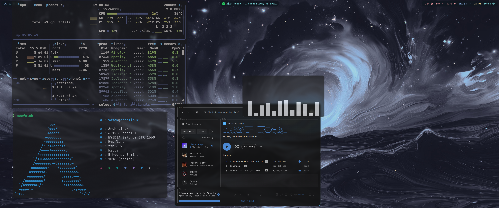
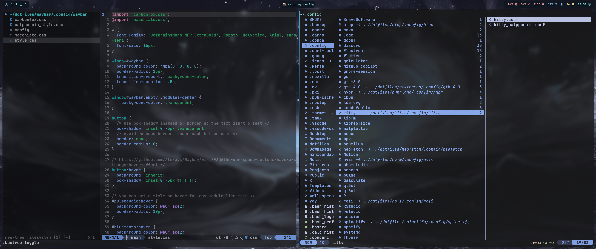

# Arch linux dotfiles
This is a repository for my dotfiles, I use Arch Linux with Hyprland as my window manager.

## Main tools Used
- Window Manager: Hyprland
- Terminal: Kitty
- Shell: Zsh (with p10k)
- Editor: Neovim (with Lazy.nvim as the plugin manager) / VSCode
- Audio: PipeWire
- Spotify: Spicetify
- File Manager: Yazi / Nautilus

## Installation
```
git clone https://github.com/eolybq/dotfiles.git ~/dotfiles
cd ~/dotfiles
```
Then you have to run `stow <each_folder_name>` to symlink the package conf files to the right directory.

## Packages
All manually installed packages with pacman are listed in the `packages.txt` file. Similarly all AUR packages installed with yay are listed in the `aur_packages.txt` file.

Run `sudo pacman -S --needed - < packages.txt` and `yay -S --needed - < aur_packages.txt` to install.

## Theme
Main theme is CarbonFox, although some apps like waybar or rofi are hand themed to look similar.
There are also theme files of catppuccin macchiato which can be easily applied or renamed in order to swap theme. 

## Screenshots


