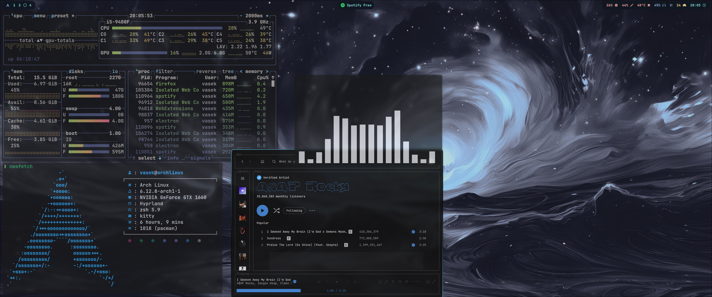
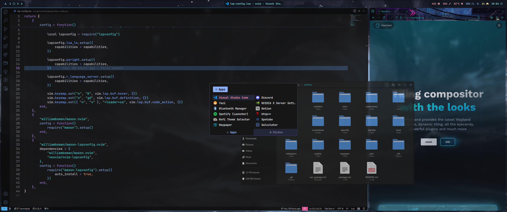

# Arch linux dotfiles
This is a repository for my dotfiles, I use Arch Linux with Hyprland as my window manager.

## Main tools Used
- Window Manager: Hyprland
- Terminal: Kitty
- Shell: Zsh (with p10k)
- Editor: Neovim (with Lazy.nvim as the plugin manager) / VSCode
- App launcher: Rofi
- Status bar: Waybar
- Audio: PipeWire
- Spotify: Spicetify
- File Manager: Yazi / Nautilus

## Installation
```
git clone https://github.com/eolybq/dotfiles.git ~/dotfiles
cd ~/dotfiles
```
Then you have to run `stow <each_config_folder_name>` to symlink the package conf files to the right directory.

## Packages
All manually installed packages with pacman are listed in the `packages.txt` file. Similarly all AUR packages installed with yay are listed in the `aur_packages.txt` file.

Run `sudo pacman -S --needed - < packages.txt` and `yay -S --needed - < aur_packages.txt` to install.

## Theme
Main theme is NightFox colorscheme CarbonFox, which is available only for some packages like nvim, vscode or gtk apps. Therefore some things like waybar or rofi are hand themed to look similar.
The custom CarbonFox theme configs are based on catppuccin macchiato, which with this system config looks quite good too. The unchanged theme files of catppuccin macchiato are in config folders so that it can be easily applied or renamed in order to swap theme. 

## Screenshots




